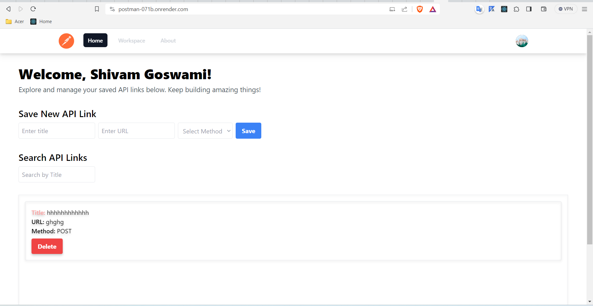
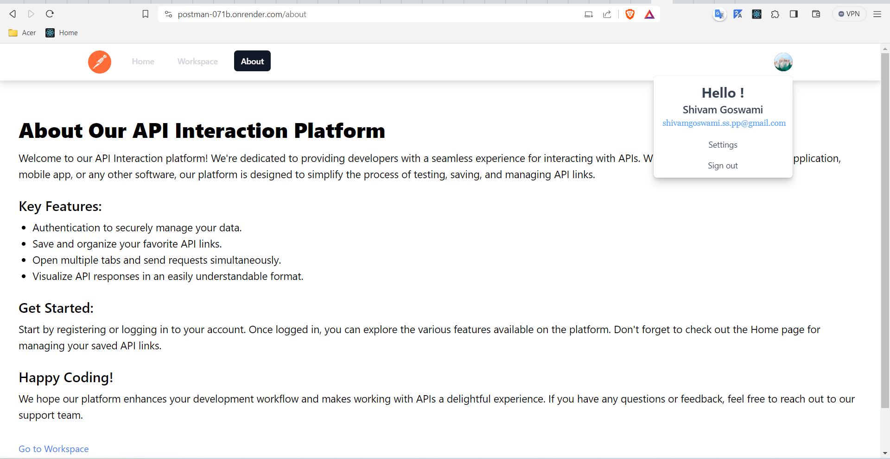
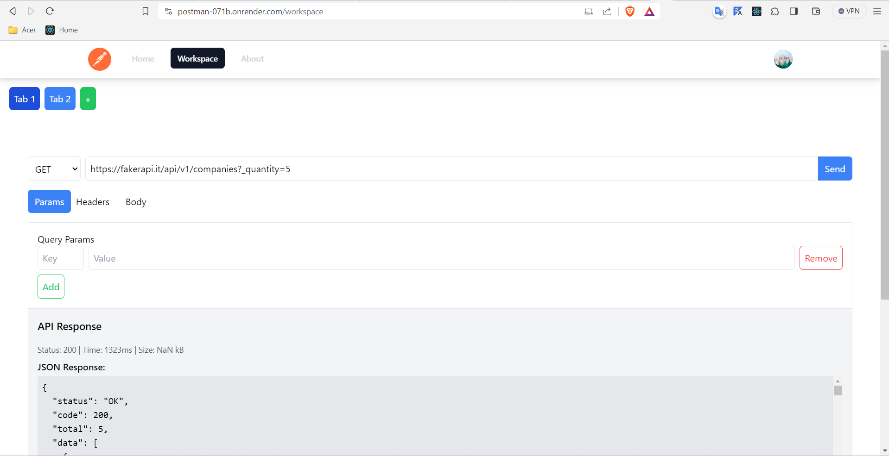

# Your App Name

## Overview

Briefly describe your application. Include its purpose, features, and any other relevant information.

## Screenshots

Include screenshots or images showcasing the different views or features of your app.







*Caption for Screenshot 2*

## How to Run Locally

### Frontend (main branch)

1. Clone the repository:

    ```bash
    git clone https://github.com/lazyshivam/Postman_App.git
    ```

2. Switch to the frontend branch:

    ```bash
    git checkout main
    ```

3. Install dependencies:

    ```bash
    cd frontend
    npm install
    ```

4. Run the development server:

    ```bash
    npm start
    ```

    Open your browser and go to [http://localhost:3000](http://localhost:3000).

### Backend (master branch)

1. Clone the repository:

    ```bash
    git clone https://github.com/lazyshivam/Postman_App.git
    ```

2. Switch to the backend branch:

    ```bash
    git checkout master
    ```

3. Install dependencies:

    ```bash
    cd backend
    npm install
    ```

4. Run the server:

    ```bash
    npm start
    ```

    The backend server will be running on [http://localhost:8000](http://localhost:8000).

## Additional Information

Provide any additional information that users or contributors might need, such as API documentation, configuration settings, or known issues.

## License

Specify the license under which your application is released. For example, [MIT License](LICENSE).


